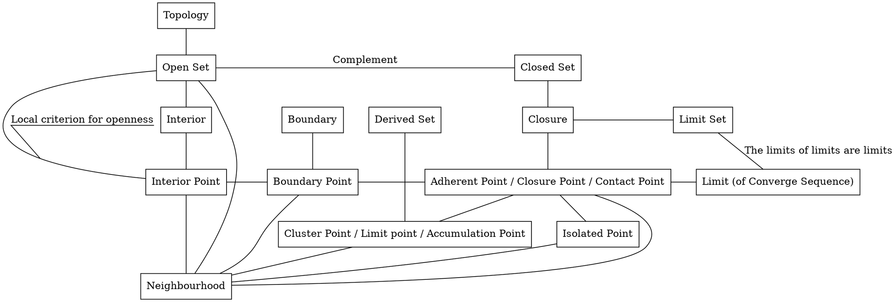

## License  
```  
Copyright (C) YuqiaoZhang

This program is free software: you can redistribute it and/or modify it under the terms of the GNU Lesser General Public License as published by the Free Software Foundation, either version 3 of the License, or (at your option) any later version.

This program is distributed in the hope that it will be useful, but WITHOUT ANY WARRANTY; without even the implied warranty of MERCHANTABILITY or FITNESS FOR A PARTICULAR PURPOSE.  See the GNU Lesser General Public License for more details.

You should have received a copy of the GNU Lesser General Public License along with this program.  If not, see <https://www.gnu.org/licenses/>
```  

### Boundedness Theorem 有界性定理  
\[Pugh 2015\] / 22 Theorem  
  
> Proof - Sketch  
> 1 we claim c = the Least Upper Bound of the set { x ∈ \[a,b\] : f(x) is bounded on \[a,x\] }  
> 2 we claim f(x) is bounded on \[a,c\] **NOTE since c can equal b, if the interval \[a,b\] were half-open \[a,b), we would have f(x) may not be continuous at c by applying b to c**  
> 3 we claim c = b  
>  
> Dependency  
> Least Upper Bound Property \# \[Pugh 2015\] / 2 Theorem  
> 函数极限的局部有界性 \# \[同济大学数学系 2014\] / 第一章 函数与极限 / 二、函数极限的性质/定律2（函数极限的局部有界性）  
>  

### Extreme Value Theorem 极值定理 // Maximum-Minimum Theorem 最大值最小值定理  
\[Pugh 2015\] / 23 Theorem  


### Intermediate Value Theorem 介值定理  

## Topology  



### Mapping (Topology)  
Inject 单射 / one-to-one 一一映射  
Surject 满射 / onto  
Biject 双射

### Continuous Mapping (Topology) 连续映射(拓扑)  
The sequential convergence preservation condition  
\[Pugh 2015\] / 2 A Taste of Topology / 2 Continuity / Definition  

The (ϵ, δ)-Condition  
\[Pugh 2015\] / 2 A Taste of Topology / 2 Continuity / The (ϵ, δ)-Condition / 4 Theorem  
ProofWiki / Sequential Continuity is Equivalent to Continuity in the Reals  
ProofWiki / Continuous Mapping is Sequentially Continuous  

The sequential convergence preservation condition (Improved)
\[Pugh 2015\] / 2 A Taste of Topology / Exercises / 13  
> Proof - Sketch  
> we construct (pn) such that pn = q + 1/n as "4 Theorem //The (ϵ, δ)-Condition"  
> we construct (qn) such that q2n = p and q2n-1 = pn which impies (qn) doesn't converge  
>  

### Homeomorphism 同胚 / homeomorphic 同胚的  
\[Pugh 2015\] / Figure 31  
The inverse of continuous bijection may not be continuous.  
  
\[Pugh 2015\] / Figure 32  
Trefoil Knot 三叶结  
Torus 环面  

Circle - Trefoil Knot - Square //**Attention:** Square vs Sphere  
Donut(2-Torus) - Coffee Cup  
//Unit Interval - Closed Unit Disk //Pending?  

ProofWiki / Trefoil Knot is Homeomorphic to Circle  
ProofWiki / Jokes / Coffee and Doughnuts  

### Limit  
\[Pugh 2015\] / 2 A Taste of Topology / Convergent Sequences and Subsequences  

Limit Point 极点 / Cluster Point 聚点 / Accumulation Point //**Attention:** Limit Point vs Limit of Sequence  
Isolated Point 孤立点  
Adherent Point 附着点 //Adherent Point ⇔ Limit (of Sequence) \[Pugh 2015\]  
\[Pugh 2015\] / 2 A Taste of Topology / 3 The Topology of a Metric Space / 5 Theorem  
($\displaystyle p_n$) converges to p ⇒ p is the adherent point  
ProofWiki / Closure of Subset of Metric Space by Convergent Sequence  

### Closed Set / Open Set  

\[Pugh 2015\] / 2 A Taste of Topology / 3 The Topology of a Metric Space / Definition //Open Set  

Open sets are unions of its r-neighborhoods  
\[Tu 2011\] / Local criterion for openness  
ProofWiki / Interior of Open Set  
ProofWiki / Equivalence of Definitions of Interior  
~~ProofWiki / Set is Open iff Neighborhood of all its Points~~  

Complement //[a, b] is closed since [a, b] is the complement of the open set ($\displaystyle -\infin$, b) $\displaystyle \cup$ (a, $\displaystyle +\infin$)  
//{0} $\displaystyle \cup$ {$\displaystyle \frac{1}{n}$ : n ∈ N} is closed since {0} $\displaystyle \cup$ {$\displaystyle \frac{1}{n}$ : n ∈ N} is the complement of the open set ($\displaystyle -\infin$, 0) $\displaystyle \cup$ (0, $\displaystyle \frac{1}{n}$) $\displaystyle \cup$ ($\displaystyle \frac{1}{n}$, $\displaystyle \frac{1}{n-1}$) $\displaystyle \cup$ ... $\displaystyle \cup$ ($\displaystyle \frac{1}{2}$, 1) //**NOTE** although {$\displaystyle \frac{1}{n}$} n ∈ N is closed, we can't infer the result by union since the closed set demands **Finite** union  

### Topology //induced by Metric  
union / **Finite** Intersection -produces-> Open Set  
\[Pugh 2015\] / 2 A Taste of Topology / 3 The Topology of a Metric Space / 6 Theorem  

Allow **Infinite** union //$(a, +\infin)$ is open since $(a, +\infin) = \displaystyle \bigcup_{n \isin \N} (a+\frac{1}{n}, n)$  

**Finite** Intersection //$\displaystyle \bigcap_{n \isin \N} (1-\frac{1}{n}, 2+\frac{1}{n})$=\[1,2\]  
//**Minimum of Infinite set may be undefined**   
ProofWiki / Definition:Min Operation  
ProofWiki / Definition:Operation/N-Ary Operation  
//**Minimum of Infinite set may not exist**  
//r = min{1, $\displaystyle \frac{1}{2}$, $\displaystyle \frac{1}{3}$, ... , $\displaystyle \frac{1}{n}$} n ∈ N ⇒ there doesn't exist such r  
//proof by contradiction  
//by archimedean property, we would find a number less than r if r were greater than 0  
//and thus we would have r is not the minimum  
  
Intersection / **Finite** union -produces-> Open Set  

The limits of limits are limits  
\[Pugh 2015\] / 2 A Taste of Topology / 3 The Topology of a Metric Space / 8 Theorem  
> choose $\displaystyle q_n$ from S (not from limS)  

Closure ⇔ Limit Set \[Pugh 2015\]  
Idempotent //lim(limS) = limS  
\[Pugh 2015\] / 2 A Taste of Topology / 3 The Topology of a Metric Space / 10 Corollary
> S ⊂ K ⇒ Limit(Adherent Point) of S ⊂ Limit(Adherent Point) of K    

### Continuous Mapping (Topology) 连续映射(拓扑)  
//**TODO** above "Continuous Mapping (Topology) 连续映射(拓扑)" move here  

PreImage 原像 //Inverse Image 逆像 //inverse map f-1 may not exist  
Annulus 环形  

\[Pugh 2015\] / 2 A Taste of Topology / 3 The Topology of a Metric Space / Topological Description of Continuity / 11 Theorem  

The closed set condition  
> Proof - Sketch  
> K is closed in N. To prove $\displaystyle \operatorname{{f}^{pre}}$(K) is closed in M,  we assume ($\displaystyle p_n$) /\* $\displaystyle p_n$ $\displaystyle \isin$ $\displaystyle \operatorname{{f}^{pre}}$(K) \*/ converges to p and it suffices to prove p $\displaystyle \isin$ $\displaystyle \operatorname{{f}^{pre}}$(K).  
> f(p) $\displaystyle \isin$ K /\* which implies p $\displaystyle \isin$ $\displaystyle \operatorname{{f}^{pre}}$(K) \*/ since (f($\displaystyle p_n$)) converges to f(p) in N and K is closed.  

The open set condition //As the defination in general topology  
> Proof - Sketch  
> construct $\displaystyle N_\epsilon$f(p) /\* ϵ-neighbourhood of f(p) in N \*/ which is open in N  
> $\displaystyle \operatorname{{f}^{pre}}$($\displaystyle N_\epsilon$f(p)) is open in M and p $\displaystyle \isin$ $\displaystyle \operatorname{{f}^{pre}}$($\displaystyle N_\epsilon$f(p))  
> exists δ such that δ-neighbourhood of p $\displaystyle \subset$ $\displaystyle \operatorname{{f}^{pre}}$($\displaystyle N_\epsilon$f(p))  

\[Pugh 2015\] / 2 A Taste of Topology / 3 The Topology of a Metric Space / Topological Description of Continuity / 12 Corollary  
Homeomorphism $\displaystyle \Leftrightarrow$ Topological Equivalence  

\[Pugh 2015\] / 2 A Taste of Topology / Exercise / 28  
Open Mapping 开映射  

continous mapping may not send open sets to open sets  
$\displaystyle \operatorname{f^{-1}}$ is continous $\displaystyle \Rightarrow$ f is open //open mapping  

### Inheritance 继承 
Subspace 子空间  
Relatively Open/Closed Set 相对开/闭集  
\[Pugh 2015\] / 2 A Taste of Topology / 3 The Topology of a Metric Space / Inheritance / 13 Inheritance Principle  
\[Pugh 2015\] / 2 A Taste of Topology / 3 The Topology of a Metric Space / Inheritance / 14 Corollary  
//induce subspace?  

\[Pugh 2015\] / 2 A Taste of Topology / 3 The Topology of a Metric Space / Inheritance / 15 Corollary  
Assume N is a subspace of M, we have that sets open relative to N may not be open relative to M.  
However, **if N is open**, sets open relative to N and sets open relative to M can be deduced by each other.

## Reference  
\[Pugh 2015\] Charles Pugh. "Real Mathematical Analysis, Second Edition." Springer 2015.  
\[Tu 2011\] Loring Tu. "An Introduction to Manifolds, Second Edition." Springer 2011.  
~~\[同济大学数学系 2014\] 同济大学数学系. "高等数学 第七版." 高等教育出版社 2014.~~   
